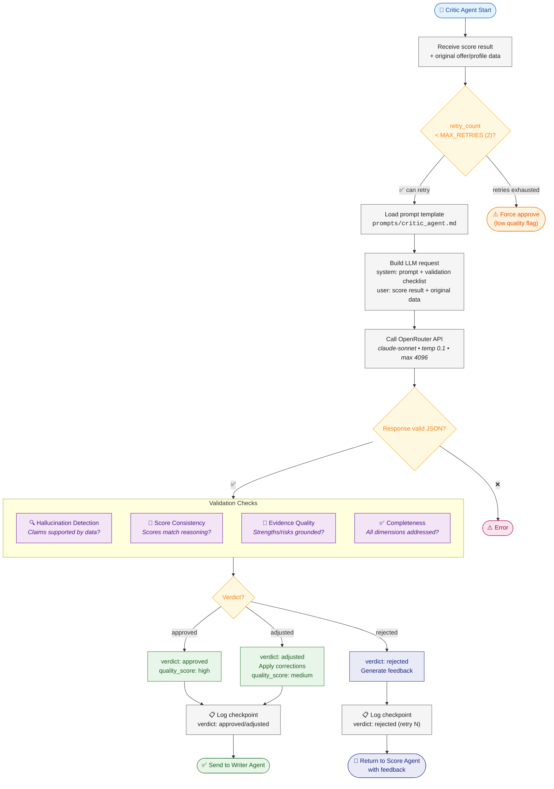

# Critic Agent — Flow Diagram

> **Owner:** TBD (Agent Developer) | **Model:** `claude-sonnet` | **Stage:** 3 of 4 | ⚠️ **MANDATORY — cannot be skipped**

## Validation Checklist
| Check | Severity if Failed | Action |
|-------|--------------------|--------|
| Hallucination detected | 🔴 High | Reject + retry |
| Score-reasoning mismatch | 🟡 Medium | Adjust or reject |
| Unsupported claims | 🟡 Medium | Adjust scores |
| Missing dimension analysis | 🟢 Low | Adjust (note gap) |

## Retry Logic
- **Max retries:** 2
- **On reject:** Score Agent re-runs with critic's specific feedback
- **On exhaustion:** Force-approve with `quality_score < 0.5` flag
