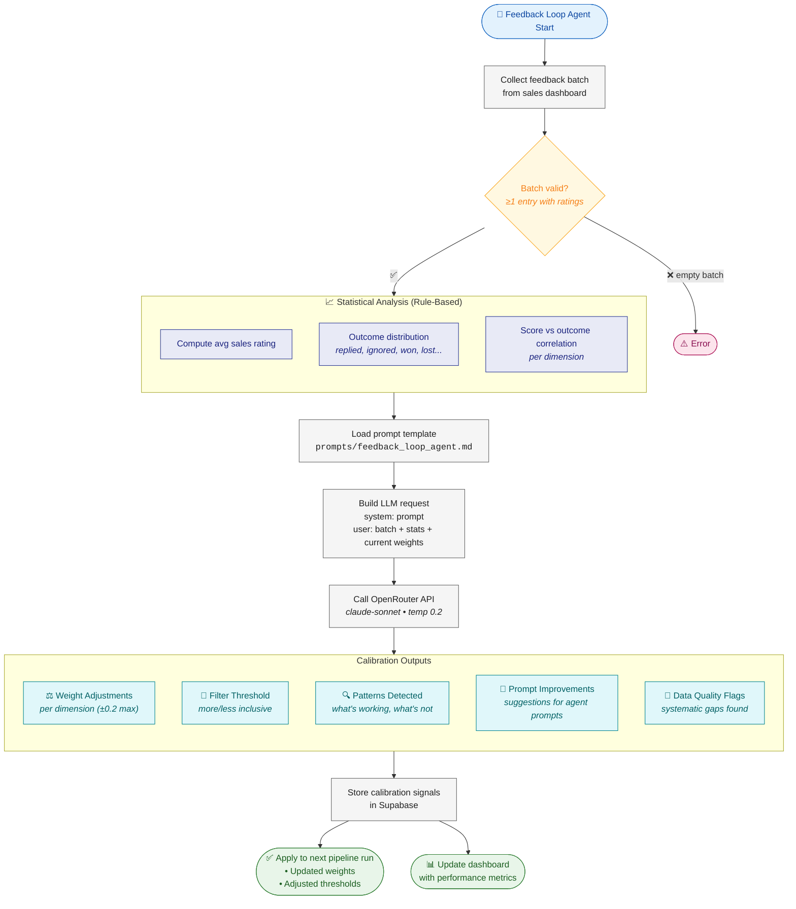

# Feedback Loop Agent — Flow Diagram

> **Owner:** TBD (Agent Developer) | **Model:** `claude-sonnet` | **Type:** Auxiliary (post-pipeline)

## Calibration Constraints
| Parameter | Range | Frequency |
|-----------|-------|-----------|
| Weight adjustments | ±0.2 per dimension per cycle | Weekly batch |
| Filter threshold | ±0.1 per cycle | Weekly batch |
| Minimum sample size | 10 feedback entries | Required |
| Confidence threshold | 0.7 for pattern detection | Per pattern |
