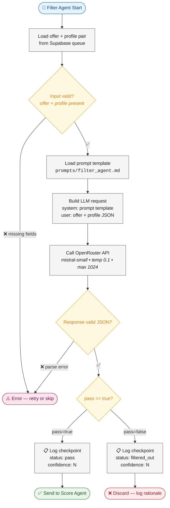

# Filter Agent — Flow Diagram

> **Owner:** TBD (Agent Developer) | **Model:** `mistral-small` | **Stage:** 1 of 4

## Input Schema
| Field | Type | Required |
|-------|------|----------|
| `offer` | `{ id, title, services, verticals, tech_stack }` | ✅ |
| `profile` | `{ id, company, industry, signals, tech_used }` | ✅ |

## Output Schema
| Field | Type | Description |
|-------|------|-------------|
| `pass` | `bool` | Whether the pair should proceed |
| `rationale` | `str` | One-sentence explanation |
| `confidence` | `float (0-1)` | Certainty of the decision |

## Design Decisions
- **Inclusive by default:** When in doubt, pass. False negatives are worse than false positives at this stage.
- **Cheap model:** Uses mistral-small for cost efficiency — this runs on every pair.
- **Low temperature (0.1):** Consistency over creativity for binary decisions.
