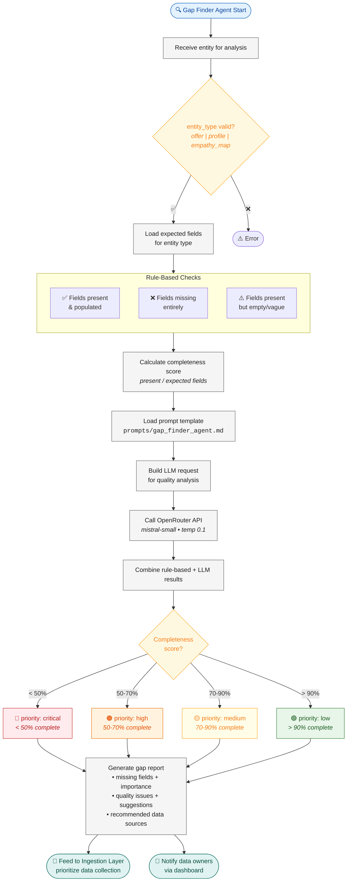

# Gap Finder Agent — Flow Diagram

> **Owner:** TBD (Agent Developer) | **Model:** `mistral-small` | **Type:** Auxiliary (pre/post pipeline)

## Expected Fields per Entity
| Entity | Critical Fields | Total Expected |
|--------|----------------|----------------|
| Offer | title, services, verticals, tech_stack | 8 |
| Profile | company, industry, tech_used, pain_points | 9 |
| Empathy Map | thinks, feels, pain_points, goals | 9 |
