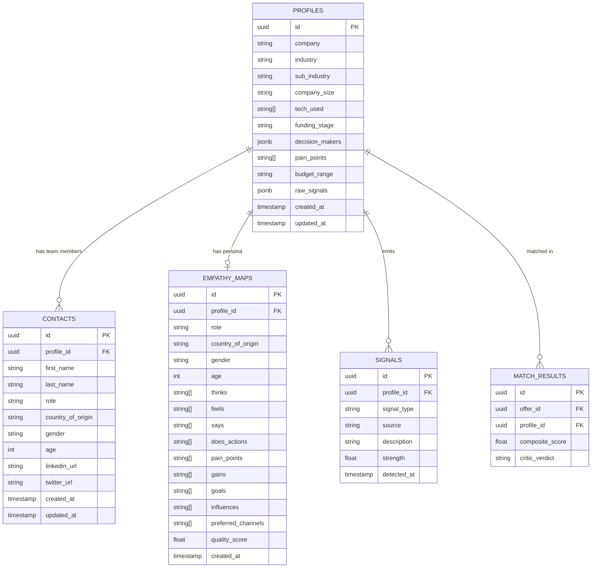

# Profiles & Contacts — Data Model Detail

> **Owner:** Ivor Jugo (external) / Rado Patus (internal) | **Contacts Owner:** Diego Torres

## Contacts

People within each company profile. Used by the Writer Agent to personalize outreach to specific decision makers.

| Field | Type | Description |
|-------|------|-------------|
| `id` | uuid (PK) | Contact identifier |
| `profile_id` | uuid (FK) | Parent company profile |
| `first_name` | string | First name |
| `last_name` | string | Last name |
| `role` | string | Job title / role in the company |
| `country_of_origin` | string | Country of origin |
| `gender` | string | Gender |
| `age` | int | Age |
| `linkedin_url` | string | LinkedIn profile URL |
| `twitter_url` | string | Twitter/X profile URL |

## Empathy Maps — Demographic Fields

The empathy map now includes demographic context to improve personalization:

| Field | Type | Purpose |
|-------|------|---------|
| `role` | string | Persona's role — affects tone and talking points |
| `country_of_origin` | string | Cultural context for communication style |
| `gender` | string | Inclusive language adaptation |
| `age` | int | Generational communication preferences |

These fields feed into the **Writer Agent** for channel selection and tone matching, and into the **Score Agent** for relationship proximity assessment.
