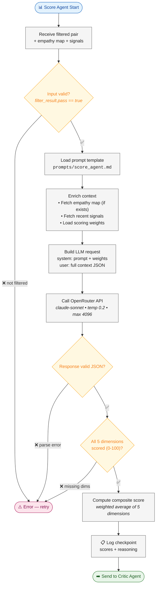

# Score Agent — Flow Diagram

> **Owner:** TBD (Agent Developer) | **Model:** `claude-sonnet` | **Stage:** 2 of 4

## Scoring Dimensions
| # | Dimension | Weight (default) | Description |
|---|-----------|-----------------|-------------|
| 1 | Industry Alignment | 0.25 | Vertical/sub-industry match |
| 2 | Technical Fit | 0.25 | Tech stack overlap |
| 3 | Budget Signals | 0.20 | Spending capacity indicators |
| 4 | Timing/Urgency | 0.15 | Need-now signals |
| 5 | Relationship Proximity | 0.15 | Network closeness |

*Weights are calibrated by the Feedback Loop Agent over time.*
