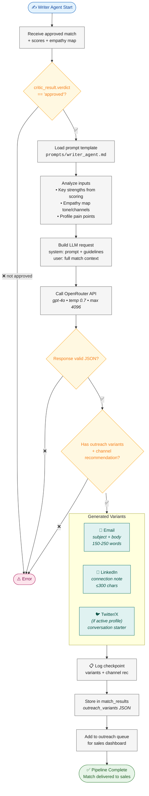

# Writer Agent — Flow Diagram

> **Owner:** TBD (Agent Developer) | **Model:** `gpt-4o` | **Stage:** 4 of 4

```mermaid
flowchart TD
    START(["✍️ Writer Agent Start"])
    
    RECEIVE["Receive approved match<br/>+ scores + empathy map"]
    VALIDATE_IN{"critic_result.verdict<br/>== 'approved'?"}
    
    LOAD_PROMPT["Load prompt template<br/><code>prompts/writer_agent.md</code>"]
    
    ANALYZE["Analyze inputs<br/>• Key strengths from scoring<br/>• Empathy map tone/channels<br/>• Profile pain points"]
    
    BUILD["Build LLM request<br/>system: prompt + guidelines<br/>user: full match context"]
    CALL["Call OpenRouter API<br/><i>gpt-4o • temp 0.7 • max 4096</i>"]
    PARSE{"Response valid JSON?"}
    
    VALIDATE_OUT{"Has outreach variants<br/>+ channel recommendation?"}

    subgraph VARIANTS["Generated Variants"]
        direction LR
        EMAIL["📧 Email<br/><i>subject + body<br/>150-250 words</i>"]
        LINKEDIN["💼 LinkedIn<br/><i>connection note<br/>≤300 chars</i>"]
        TWITTER["🐦 Twitter/X<br/><i>(if active profile)<br/>conversation starter</i>"]
    end

    CHECKPOINT["📋 Log checkpoint<br/>variants + channel rec"]
    
    STORE["Store in match_results<br/><i>outreach_variants JSON</i>"]
    QUEUE["Add to outreach queue<br/>for sales dashboard"]
    
    OUT(["✅ Pipeline Complete<br/>Match delivered to sales"])
    ERROR_OUT(["⚠️ Error"])

    START --> RECEIVE
    RECEIVE --> VALIDATE_IN
    VALIDATE_IN -->|"❌ not approved"| ERROR_OUT
    VALIDATE_IN -->|"✅"| LOAD_PROMPT
    LOAD_PROMPT --> ANALYZE
    ANALYZE --> BUILD
    BUILD --> CALL
    CALL --> PARSE
    PARSE -->|"❌"| ERROR_OUT
    PARSE -->|"✅"| VALIDATE_OUT
    VALIDATE_OUT -->|"❌"| ERROR_OUT
    VALIDATE_OUT -->|"✅"| VARIANTS
    VARIANTS --> CHECKPOINT
    CHECKPOINT --> STORE
    STORE --> QUEUE
    QUEUE --> OUT

    classDef start fill:#e3f2fd,stroke:#1565c0,color:#0d47a1
    classDef process fill:#f5f5f5,stroke:#616161,color:#212121
    classDef decision fill:#fff8e1,stroke:#f9a825,color:#f57f17
    classDef success fill:#e8f5e9,stroke:#2e7d32,color:#1b5e20
    classDef variant fill:#e0f2f1,stroke:#00695c,color:#004d40
    classDef error fill:#fce4ec,stroke:#ad1457,color:#880e4f

    class START start
    class RECEIVE,LOAD_PROMPT,ANALYZE,BUILD,CALL,CHECKPOINT,STORE,QUEUE process
    class VALIDATE_IN,PARSE,VALIDATE_OUT decision
    class OUT success
    class EMAIL,LINKEDIN,TWITTER variant
    class ERROR_OUT error
```
