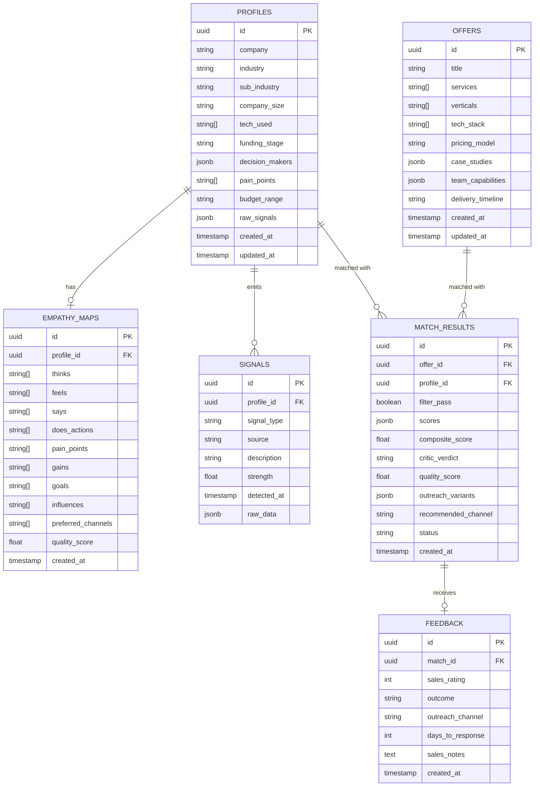

# BD Automation — Data Model

> **Edit this diagram:** Open in [Mermaid Live Editor](https://mermaid.live) — paste the code below, edit visually, then copy back and submit a PR.

```mermaid
erDiagram
    OFFERS {
        uuid id PK
        string title
        string[] services
        string[] verticals
        string[] tech_stack
        string pricing_model
        jsonb case_studies
        jsonb team_capabilities
        string delivery_timeline
        timestamp created_at
        timestamp updated_at
    }

    PROFILES {
        uuid id PK
        string company
        string industry
        string sub_industry
        string company_size
        string[] tech_used
        string funding_stage
        jsonb decision_makers
        string[] pain_points
        string budget_range
        jsonb raw_signals
        timestamp created_at
        timestamp updated_at
    }

    EMPATHY_MAPS {
        uuid id PK
        uuid profile_id FK
        string[] thinks
        string[] feels
        string[] says
        string[] does_actions
        string[] pain_points
        string[] gains
        string[] goals
        string[] influences
        string[] preferred_channels
        float quality_score
        timestamp created_at
    }

    SIGNALS {
        uuid id PK
        uuid profile_id FK
        string signal_type
        string source
        string description
        float strength
        timestamp detected_at
        jsonb raw_data
    }

    MATCH_RESULTS {
        uuid id PK
        uuid offer_id FK
        uuid profile_id FK
        boolean filter_pass
        jsonb scores
        float composite_score
        string critic_verdict
        float quality_score
        jsonb outreach_variants
        string recommended_channel
        string status
        timestamp created_at
    }

    FEEDBACK {
        uuid id PK
        uuid match_id FK
        int sales_rating
        string outcome
        string outreach_channel
        int days_to_response
        text sales_notes
        timestamp created_at
    }

    OFFERS ||--o{ MATCH_RESULTS : "matched with"
    PROFILES ||--o{ MATCH_RESULTS : "matched with"
    PROFILES ||--o| EMPATHY_MAPS : "has"
    PROFILES ||--o{ SIGNALS : "emits"
    MATCH_RESULTS ||--o| FEEDBACK : "receives"
```
