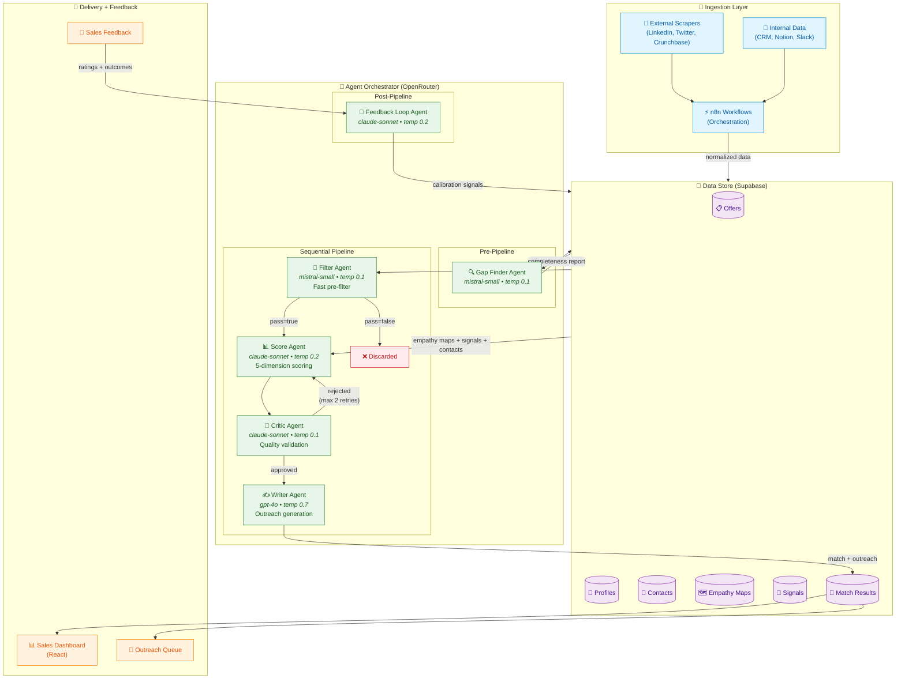

# BD Automation — Pipeline Overview

> **Edit this diagram:** Open in [Mermaid Live Editor](https://mermaid.live) — paste the code below, edit visually, then copy back and submit a PR.

## How to Edit

1. Copy the Mermaid code block above
2. Open [Mermaid Live Editor](https://mermaid.live)
3. Paste and edit visually
4. Copy the updated code back
5. Submit a PR with your changes to `docs/diagrams/pipeline-overview.md`

Changes to this diagram should be discussed with the Architecture Owner (Federico Ledesma) before merging.

---

## Architecture — End-to-End Flow Explanation

### Overview

The BD Automation system is an AI-powered pipeline that automatically matches Protofire's service offerings with potential client profiles, generates personalized outreach content, and continuously improves its accuracy through sales team feedback. The system is organized into four layers — Ingestion, Data Store, Agent Orchestrator, and Delivery + Feedback — each with clearly defined responsibilities and structured input/output contracts between them.

### Layer 1 — Ingestion

The pipeline begins at the Ingestion Layer, which is responsible for collecting, normalizing, and loading data from both external and internal sources into the central data store.

**External scrapers** (owned by Ivor Jugo) continuously monitor public sources — LinkedIn company pages and profiles, Twitter/X activity, and Crunchbase funding records — to build and update profiles of potential clients. These scrapers detect buying signals such as recent funding rounds, executive hires, technology adoption announcements, and public RFPs that indicate a company might be in the market for Protofire's services.

**Internal data connectors** (owned by Rado Patus) pull structured data from Protofire's own systems — CRM records of past interactions, Notion databases with account notes, and Slack channels where team members share leads and intelligence. This internal data provides relationship context that external sources cannot: prior conversations, warm introductions, existing partnerships, and historical engagement.

Both data streams converge in **n8n**, a self-hosted workflow orchestration platform with over 400 integrations. n8n workflows handle the scheduling, deduplication, normalization, and error handling required to transform raw scraped data and internal exports into clean, structured records. Each workflow is exported as a JSON file and version-controlled in the repository under `ingestion/n8n-workflows/`.

The output of the Ingestion Layer is normalized data written into seven Supabase tables: offers, profiles, contacts, empathy maps, signals, match results, and feedback.

### Layer 2 — Data Store

The Data Store layer uses **Supabase** (PostgreSQL with pgvector) as the single source of truth for all entities in the system. Supabase was chosen over Notion for its SQL query capabilities, real-time subscriptions, edge functions, row-level security, and cost efficiency at scale.

The data model consists of seven core entities:

- **Offers** define what Protofire sells: the services provided, target industry verticals, technology stack involved, pricing model, relevant case studies, team capabilities, and expected delivery timelines. These are maintained by Cristian Malfesi and represent the "supply side" of the matching equation.

- **Profiles** represent potential client companies: the company name, primary industry, sub-industry classification, company size, technologies currently in use, funding stage, key decision makers, known pain points, and estimated budget range. Profiles are the "demand side" of the matching equation and are populated by both external scrapers and internal connectors.

- **Contacts** are the individual people within each company profile — first name, last name, job role, country of origin, gender, age, and their LinkedIn and Twitter URLs. The contacts table enables the Writer Agent to personalize outreach to specific decision makers rather than generic company addresses.

- **Empathy Maps** capture the qualitative persona framework for each profile: what the prospect thinks, feels, says, and does, along with their pain points, desired gains, business goals, key influences, and preferred communication channels. Empathy maps also include demographic fields — role, country of origin, gender, and age — that provide cultural and generational context for personalization. These are owned by Diego Torres and are critical inputs to both the Score Agent and the Writer Agent.

- **Signals** are discrete market events detected by the scrapers — funding announcements, hiring surges, product launches, technology adoptions, regulatory changes, or any other event that indicates buying intent. Each signal has a type, source, description, strength score, and timestamp.

- **Match Results** store the output of the agent pipeline: whether the pair passed the filter, the five dimension scores, the composite score, the critic's verdict and quality rating, the generated outreach message variants, and the recommended channel.

- **Feedback** records the sales team's response to each match: their rating of match quality (1-5), the outcome of the outreach (replied, ignored, bounced, meeting booked, proposal sent, won, or lost), which channel was used, how long it took to get a response, and any qualitative notes.

### Layer 3 — Agent Orchestrator

The Agent Orchestrator is the intelligence layer of the system. It uses **OpenRouter** as a unified LLM gateway that routes each agent to its optimal model based on the task requirements — cheap and fast models for high-volume filtering, strong reasoning models for scoring and validation, and creative models for content generation.

The orchestrator operates in three phases: pre-pipeline, sequential pipeline, and post-pipeline.

#### Pre-Pipeline: Gap Finder Agent

Before any offer-profile pair enters the main matching pipeline, the **Gap Finder Agent** (running on mistral-small at temperature 0.1) audits the data completeness of both the offer and the profile. It checks each entity against its expected fields — 8 for offers, 9 for profiles, 8 for contacts, and 13 for empathy maps — and produces a completeness score between 0 and 1 along with a prioritized list of missing fields, quality issues, and recommended data sources.

Pairs with critically incomplete data (completeness below 50%) are flagged for the ingestion layer to prioritize data collection before they enter the pipeline. This prevents the downstream agents from making decisions on insufficient information.

#### Sequential Pipeline: Filter → Score → Critic → Writer

The main pipeline processes offer-profile pairs through four agents in strict sequence, with a checkpoint logged after each stage for observability and debugging.

**Stage 1 — Filter Agent** (mistral-small, temperature 0.1, max 1024 tokens): The Filter Agent performs a fast, inexpensive triage on every offer-profile pair. Its job is to determine whether the pair is a plausible match worth scoring in depth. The filter is deliberately inclusive — it passes any pair where there is meaningful overlap in industry, technology, use case, or buying signals. A pair only fails if there is zero overlap across all dimensions and the company's stage and size are completely misaligned. The output is a boolean pass/fail, a confidence score between 0 and 1, and a one-sentence rationale. Pairs that fail are discarded with their rationale logged. Pairs that pass proceed to the Score Agent. This stage runs on a cheap, fast model because it processes the highest volume — every pair in the system goes through it.

**Stage 2 — Score Agent** (claude-sonnet, temperature 0.2, max 4096 tokens): The Score Agent performs a deep, multi-dimensional analysis of each filtered pair. It evaluates the match across five scoring dimensions, each rated 0-100: **Industry Alignment** (how well the profile's industry matches the offer's target verticals, including sub-industries and adjacent markets), **Technical Fit** (overlap between the profile's tech stack and the offer's capabilities, including complementary technologies and migration paths), **Budget Signals** (evidence of spending capacity — funding rounds, revenue signals, hiring patterns, tech spending indicators), **Timing/Urgency** (signals suggesting the profile needs this solution now — recent events, hiring surges, product launches, regulatory changes), and **Relationship Proximity** (how close Protofire's network is to this profile — shared connections, ecosystem overlap, previous interactions). The agent also produces a composite score (weighted average of the five dimensions), a 2-3 paragraph reasoning explanation, a list of key strengths, and a list of key risks. This stage uses a strong reasoning model because the quality of the scoring directly determines the quality of the final matches.

**Stage 3 — Critic Agent** (claude-sonnet, temperature 0.1, max 4096 tokens): The Critic Agent is the quality gate of the pipeline and **cannot be skipped**. It receives the Score Agent's output along with the original offer and profile data and performs four validation checks: **Hallucination Detection** (does the reasoning cite facts actually present in the input data, or are there invented details?), **Score Consistency** (do the numeric scores align with the reasoning text — if reasoning says "strong technical fit" but the score is 30, that is a contradiction), **Evidence Quality** (is each key strength and risk backed by specific data points rather than vague claims?), and **Completeness** (does the reasoning address all five dimensions and acknowledge missing data?). The critic issues one of three verdicts: "approved" (the scoring passes all checks), "adjusted" (the critic found minor issues and corrected them directly), or "rejected" (significant problems require the Score Agent to re-run with specific feedback from the critic). If rejected, the Score Agent re-runs with the critic's feedback appended to its prompt, producing a new scoring that goes back through the critic. This retry loop runs a maximum of 2 times. If the scoring still fails after 2 retries, the critic force-approves it with a low quality flag so a human reviewer can examine it. The critic uses a low temperature (0.1) for maximum consistency in its evaluations.

**Stage 4 — Writer Agent** (gpt-4o, temperature 0.7, max 4096 tokens): The Writer Agent generates personalized outreach content for every approved match. It receives the full context: the offer, the profile, the contacts within the profile, the scoring results (including key strengths and risks), the empathy map (if available), and the critic's validation. Using this context, it produces 2-3 outreach variants across different channels — an **email** with a compelling subject line and a 150-250 word body, a **LinkedIn** connection note or InMail (respecting the 300 character limit for connection requests), and optionally a **Twitter/X** conversation starter if the prospect has an active Twitter presence. Each variant includes the tone used (formal, casual, or technical), and the specific personalization hooks employed (what details from the profile were woven into the message). The agent also produces a set of talking points, a recommended channel, and a suggested follow-up timing sequence. The writer uses a high temperature (0.7) to produce creative, varied, and human-sounding content rather than templated outputs. The demographic fields from the empathy map — role, country of origin, gender, and age — inform the tone, formality level, and cultural references used in the outreach.

#### Post-Pipeline: Feedback Loop Agent

The **Feedback Loop Agent** (claude-sonnet, temperature 0.2) runs on a weekly batch schedule, processing all accumulated sales feedback since the last run. It analyzes the correlation between original scores and actual outcomes: which dimension scores predicted success, which channels produced the best response rates, which types of profiles converted, and which patterns the system is getting wrong.

The agent produces five types of calibration outputs: **weight adjustments** for the five scoring dimensions (maximum ±0.2 per cycle to prevent overcorrection), **filter threshold changes** (should the filter be more or less inclusive), **pattern detection** (what is systematically working or failing), **prompt improvement suggestions** (what the agent prompts should change), and **data quality flags** (what data gaps are most frequently hurting match quality). These calibration signals are written back to the data store and applied to the next pipeline run, creating a continuous improvement loop.

### Layer 4 — Delivery + Feedback

The final layer surfaces the pipeline's output to the sales team and captures their feedback.

The **Sales Dashboard** (React) presents match results in a prioritized queue, showing the composite score, key strengths, recommended channel, and generated outreach content for each match. Sales team members can review, edit, and approve outreach before it is sent.

The **Outreach Queue** manages the actual sending of approved messages through the recommended channels, tracking delivery status and response events.

**Sales Feedback** flows back into the system when team members rate match quality (1-5), record the outreach outcome, and add qualitative notes about what worked or did not. This feedback feeds the Feedback Loop Agent, closing the learning cycle and allowing the system to improve its scoring accuracy, filter calibration, and outreach personalization over time.

### System Properties

The architecture is designed around several key properties:

- **Modularity**: Each agent is independently deployable with its own model, temperature, prompt template, and I/O schema. Agents can be swapped, retrained, or replaced without affecting the rest of the pipeline.
- **Observability**: Every agent logs a checkpoint record containing the agent name, model used, timestamp, status, input keys, output keys, and any errors. This creates a complete audit trail for every match.
- **Cost efficiency**: Per-agent model routing ensures that expensive reasoning models (claude-sonnet) are only used where they add value (scoring and validation), while cheap models (mistral-small) handle the high-volume filtering.
- **Quality by design**: The mandatory Critic Agent with its retry loop ensures that no match reaches the sales team without passing quality validation. The Feedback Loop Agent ensures that quality improves over time.
- **Scalability**: The pipeline processes pairs independently and can be parallelized. Supabase handles concurrent reads and writes. n8n workflows can be scaled horizontally.
