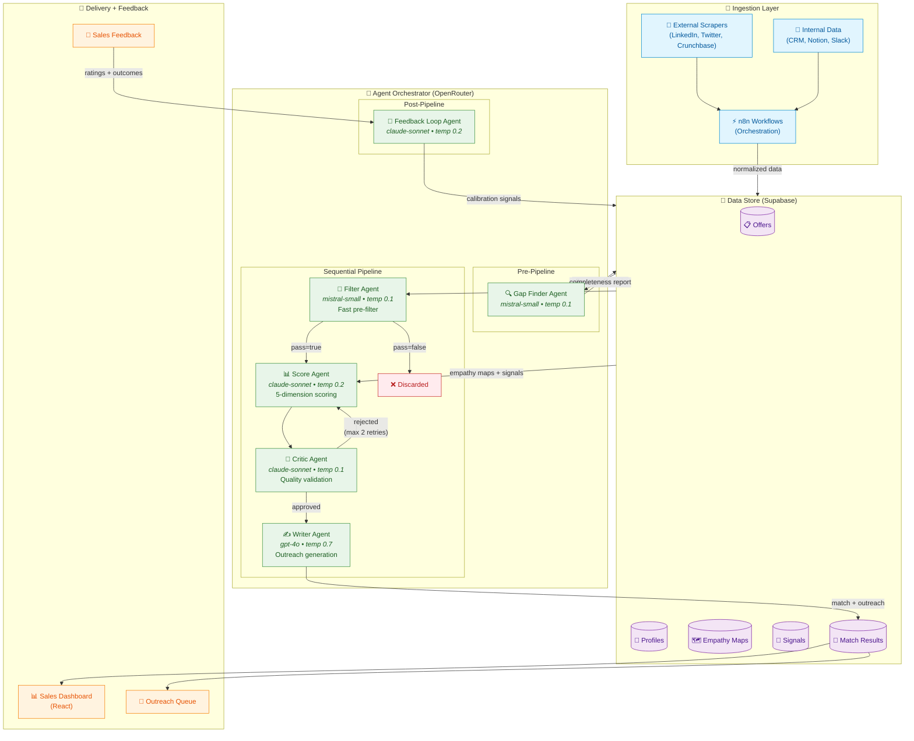

# BD Automation — Pipeline Overview

> **Edit this diagram:** Open in [Mermaid Live Editor](https://mermaid.live) — paste the code below, edit visually, then copy back and submit a PR.

## How to Edit

1. Copy the Mermaid code block above
2. Open [Mermaid Live Editor](https://mermaid.live)
3. Paste and edit visually
4. Copy the updated code back
5. Submit a PR with your changes to `docs/diagrams/pipeline-overview.md`

Changes to this diagram should be discussed with the Architecture Owner (Federico Ledesma) before merging.
